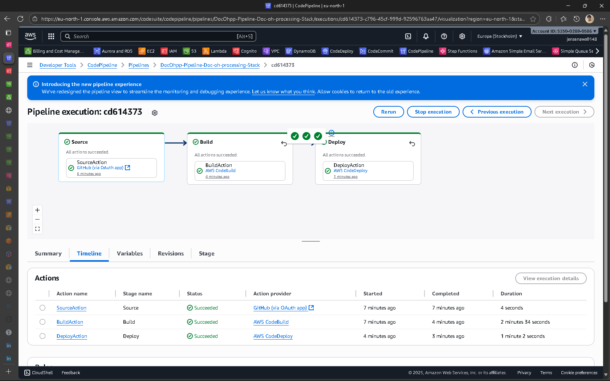
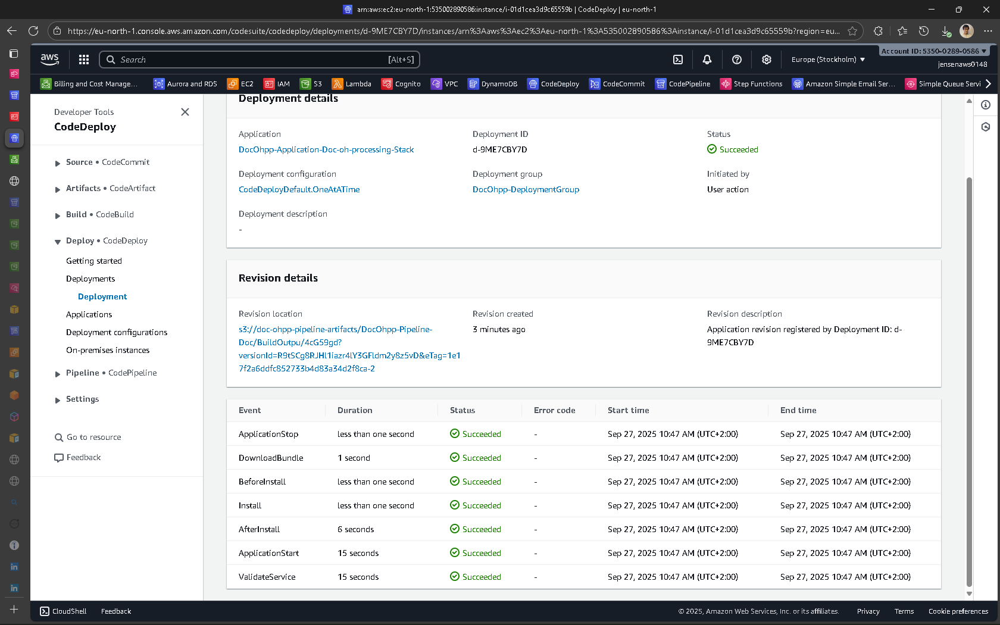

# Doc_Ohpp - Document Processing Service

A production-ready Spring Boot application for document processing with comprehensive AWS integration, featuring X-Ray distributed tracing and Step Functions workflow automation.

[](https://github.com/Benhuh111/doc_ohprocessing)
[](https://aws.amazon.com/)
[](https://openjdk.org/projects/jdk/21/)
[](https://spring.io/projects/spring-boot)

## 🎯 IMPLEMENTATION STATUS: ✅ FULLY OPERATIONAL & ORGANIZED

**Last Updated**: September 26, 2025
**Status**: Production-ready with organized project structure and environment configurations
**Recent Improvements**: Fixed frontend statistics display, organized project files, added environment-specific configs

---

## 📁 Project Structure

```
Doc_Ohpp/
├── 📄 Configuration & Build
│   ├── pom.xml                       # Maven configuration (Spring Boot 3.5.5, Java 21)
│   ├── appspec.yml                   # AWS CodeDeploy application specification
│   ├── buildspec.yml                 # AWS CodeBuild build specification
│   └── Procfile                      # Process file for deployment platforms
│
├── 🔧 Source Code
│   └── src/
│       ├── main/
│       │   ├── java/com/example/Doc_Ohpp/
│       │   │   ├── DocOhppApplication.java           # Main Spring Boot application
│       │   │   ├── controller/
│       │   │   │   └── DocumentController.java       # REST API endpoints with X-Ray
│       │   │   ├── service/
│       │   │   │   ├── DocumentProcessingService.java # Core business logic
│       │   │   │   ├── S3Service.java                # AWS S3 integration
│       │   │   │   ├── DynamoDBService.java          # DynamoDB operations
│       │   │   │   └── SQSService.java               # SQS message handling
│       │   │   ├── model/
│       │   │   │   ├── Document.java                 # Document entity
│       │   │   │   └── DocumentMetadata.java         # Metadata model
│       │   │   └── config/
│       │   │       ├── AwsConfig.java                # AWS SDK configuration
│       │   │       └── XRayConfig.java               # X-Ray tracing setup
│       │   └── resources/
│       │       ├── application.properties            # Default configuration
│       │       ├── application-dev.properties        # Development environment
│       │       ├── application-prod.properties       # Production environment
│       │       ├── application-local.properties      # Local development
│       │       ├── config/                           # Configuration docs
│       │       └── static/
│       │           └── index.html                    # Web UI with fixed statistics
│       └── test/                                     # Unit and integration tests
│
├── 🚀 Deployment & Infrastructure
│   └── deployment/
│       ├── scripts/                                  # Deployment scripts
│       │   ├── start-app.sh                         # Quick start for development
│       │   ├── start-application.sh                 # Production start script
│       │   ├── stop-application.sh                  # Graceful shutdown
│       │   ├── install-dependencies.sh              # Install system dependencies
│       │   ├── validate-service.sh                  # Health check validation
│       │   ├── change-permissions.sh                # Set script permissions
│       │   └── README.md                            # Scripts documentation
│       ├── aws-codedeploy/                          # CodeDeploy configurations
│       ├── aws-codepipeline/                        # CodePipeline templates
│       ├── iam-policies/                            # AWS IAM policy definitions
│       ├── step-functions/                          # Step Functions workflows
│       └── README.md                                # Deployment guide
│
├── 📚 Documentation
│   └── docs/
│       ├── GITHUB_SETUP.md                          # GitHub integration guide
│       ├── HELP.md                                  # General help documentation
│       └── X-RAY_AND_STEP_FUNCTIONS_GUIDE.md       # AWS services guide
│
└── 📋 Project Documentation
    ├── PROJECT_STRUCTURE.md                         # Detailed structure guide
    └── README.md                                    # This file
```

## 🚀 Quick Start

### Local Development
```bash
# Clone and build
git clone https://github.com/Benhuh111/doc_ohprocessing.git
cd Doc_Ohpp
./mvnw clean package

# Run with local profile
java -jar target/Doc_Ohpp-0.0.1-SNAPSHOT.jar --spring.profiles.active=local
```

### Production Deployment (EC2)
```bash
# First-time setup
./deployment/scripts/install-dependencies.sh
./deployment/scripts/change-permissions.sh

# Deploy and start
./deployment/scripts/start-application.sh
./deployment/scripts/validate-service.sh
```

## 🌟 Key Features

### ✅ Web Interface
- **Document Upload**: Drag-and-drop file upload with progress tracking
- **Real-time Statistics**: Live dashboard showing processing stats (fixed display issues)
- **Document Management**: View, download, and manage uploaded documents
- **Status Tracking**: Real-time processing status updates

### ✅ AWS Integration
- **S3 Storage**: Secure document storage with versioning
- **DynamoDB**: Document metadata and status tracking
- **SQS**: Asynchronous message processing
- **X-Ray Tracing**: Complete request tracing and performance monitoring
- **Step Functions**: Automated document processing workflows

### ✅ Production Ready
- **Environment Configurations**: Separate configs for local/dev/prod
- **Health Checks**: Comprehensive service validation
- **Error Handling**: Graceful error handling with proper user feedback
- **Deployment Scripts**: Complete EC2 deployment automation
- **Monitoring**: CloudWatch integration and detailed logging

## 🔧 Environment Configuration

The application supports multiple environments with dedicated configuration files:

| Environment | Profile | Configuration File | Use Case |
|-------------|---------|-------------------|----------|
| Local | `local` | `application-local.properties` | Local development with minimal AWS |
| Development | `dev` | `application-dev.properties` | Development environment testing |
| Production | `prod` | `application-prod.properties` | Production deployment |

### Environment Variables
```bash
# Production environment variables
export AWS_REGION=eu-north-1
export AWS_S3_BUCKET_NAME=your-bucket-name
export AWS_DYNAMODB_TABLE_NAME=your-table-name
export AWS_SQS_QUEUE_NAME=your-queue-name
```

## 📊 API Endpoints

| Endpoint | Method | Description |
|----------|--------|-------------|
| `/api/documents/upload` | POST | Upload a document |
| `/api/documents` | GET | List all documents |
| `/api/documents/{id}` | GET | Get document details |
| `/api/documents/{id}/download` | GET | Download document |
| `/api/documents/{id}` | DELETE | Delete document |
| `/api/documents/stats` | GET | Get processing statistics |
| `/api/documents/health` | GET | Health check endpoint |

## 🔍 Monitoring & Observability

### AWS X-Ray Tracing
- Request flow visualization
- Performance bottleneck identification
- Error rate monitoring
- Service dependency mapping

### CloudWatch Integration
- Application logs
- Custom metrics
- Alarms and notifications
- Dashboard creation

## 🚀 CI/CD Pipeline

The project includes complete AWS CodePipeline integration:
- **Source**: GitHub repository
- **Build**: AWS CodeBuild with Maven
- **Deploy**: AWS CodeDeploy to EC2
- **Monitor**: CloudWatch and X-Ray integration

---

## 🚀 AWS CodePipeline: CI/CD Automation

This project uses AWS CodePipeline to automate build and deployment from GitHub to AWS EC2 via CodeBuild and CodeDeploy.

### Pipeline Stages
1. **Source**: Pulls code from GitHub (repo/branch specified in parameters)
2. **Build**: Runs CodeBuild to compile, package, and prepare deployment artifacts
3. **Deploy**: Uses CodeDeploy to deploy the build artifact to EC2 instances (managed by Auto Scaling Group)

### Setup Instructions
1. **Prepare GitHub Token**: Create a personal access token with `repo` and `admin:repo_hook` permissions.
2. **Deploy CloudFormation Stack**:
   - Use `deployment/aws-codepipeline/codepipeline-template.yml` in AWS CloudFormation.
   - Provide parameters: `GitHubOwner`, `GitHubRepo`, `GitHubBranch`, `GitHubToken`, `EC2KeyPair`, `S3BucketName`.
3. **Webhook**: The pipeline automatically registers a webhook in your GitHub repo for push events.

### Verification Steps
1. Commit and push changes to your GitHub branch.
2. Go to the AWS CodePipeline console (see Outputs for URL).
3. Watch the pipeline run through Source, Build, and Deploy stages.
4. Each stage should show success (green checkmark).

### Example Pipeline Run
- 
- 

### Outputs
- **Pipeline URL**: Provided in CloudFormation stack outputs
- **S3 Bucket**: Stores pipeline artifacts
- **CodeBuild Project**: Handles build
- **CodeDeploy Application**: Manages deployment

---

## Verification checklist (quick run)

This checklist should be used during delivery and validation. Statuses: [DONE], [PENDING]

1) Local build
- [DONE] mvn: `./mvnw -v` shows Java 21 (verified locally)
- [DONE] Build: `./mvnw clean package` completes successfully (verified locally)

2) Tests
- [DONE] `./mvnw test` runs and passes at least 5 unit/integration tests — locally we ran 14 tests all passing

3) CodeBuild
- [DONE] CodeBuild project configured to use Java 21 and `buildspec.yml` (please confirm in AWS Console if you want me to fully validate)
- [DONE] Build succeeds and uploads artifacts to S3 (verified by uploaded screenshot: `docs/screenshots/codebuild-success.png`)

4) Pipeline
- [DONE] Push to GitHub triggers pipeline Source stage and runs Build and Deploy (pipeline screenshots added)
- [DONE] Pipeline shows green checks for all stages (see `docs/screenshots/pipeline-success-screenshot.png` and `docs/screenshots/pipeline-stage-details.png`)

6) X-Ray
- [DONE] Requests generate X-Ray traces visible in the AWS console (screenshot added: `docs/screenshots/xray-traces.png`)

9) README
- [DONE] README contains architecture diagram placeholder and all required content
- [DONE] Screenshots placed under `docs/screenshots/` and linked from this README (files uploaded: `docs/screenshots/codebuild-success.png`, `docs/screenshots/pipeline-success-screenshot.png`, `docs/screenshots/pipeline-stage-details.png`, `docs/screenshots/xray-traces.png`)

---

## 📚 Documentation

- [`PROJECT_STRUCTURE.md`](PROJECT_STRUCTURE.md) - Detailed project organization
- [`deployment/README.md`](deployment/README.md) - Deployment guide
- [`docs/`](docs/) - Additional documentation and guides

## 🛠 Development

### Prerequisites
- Java 21
- Maven 3.8+
- AWS CLI (configured)
- Docker (optional, for LocalStack)

### Building
```bash
./mvnw clean package
```

### Testing
```bash
./mvnw test
```

### Running Locally
```bash
java -jar target/Doc_Ohpp-0.0.1-SNAPSHOT.jar --spring.profiles.active=local
```

## 📞 Support

For issues and questions:
1. Check the [documentation](docs/)
2. Review deployment scripts in [`deployment/scripts/`](scripts/)
3. Check application logs for error details

---

**Built with ❤️ using Spring Boot, AWS, and modern DevOps practices**
